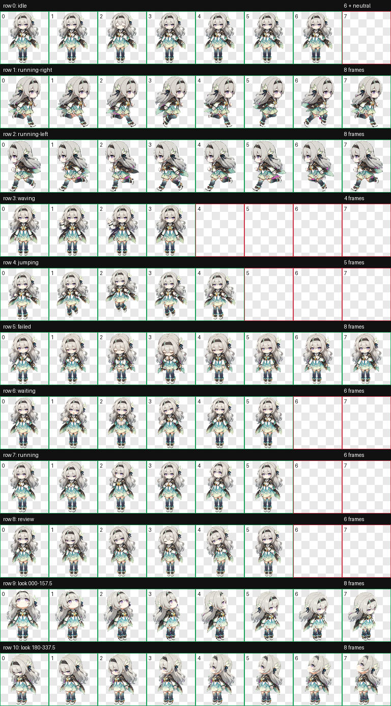

# Firefly Codex Desktop Pets / 流萤 Codex 桌面宠物

[中文](#中文) · [English](#english) · [Releases](https://github.com/RagnarokChan/firefly-codex-pets/releases/latest)

Two unofficial, fan-made Firefly desktop pets for Codex Desktop, distributed together in one repository.

两款适用于 Codex Desktop 的非官方流萤同人桌面宠物，现合并在同一个仓库中发布。

## 中文

### 包含内容

| 桌宠 | ID | 应用内描述 | 目录 |
| --- | --- | --- | --- |
| 流萤 | `firefly` | 我将，点燃星海！ | `pets/firefly` |
| 流萤花嫁 | `firefly-bride` | 此刻，我不再是「萨姆」，而只是以“流萤”的身份，走向由自己选择的未来——并非命运塑造了我们，而是我们亲手塑造了命运。 | `pets/firefly-bride` |

两款桌宠均采用 Codex v2 图集：包含 9 种标准动作和 16 个视线方向，可以同时安装。

### 预览

#### 流萤



#### 流萤花嫁


### 安装方法

1. 前往 [Releases](https://github.com/RagnarokChan/firefly-codex-pets/releases/latest)。
2. 下载 `firefly.zip`、`firefly-bride.zip`，或同时下载两者。
3. 解压后，将其中的 `firefly` 或 `firefly-bride` 文件夹复制到：

   ```text
   %USERPROFILE%\.codex\pets\
   ```

4. 检查目录结构：

   ```text
   %USERPROFILE%\.codex\pets\firefly\pet.json
   %USERPROFILE%\.codex\pets\firefly\spritesheet.webp

   %USERPROFILE%\.codex\pets\firefly-bride\pet.json
   %USERPROFILE%\.codex\pets\firefly-bride\spritesheet.webp
   ```

5. 重启 Codex，在桌宠选择页面选择“流萤”或“流萤花嫁”。

也可以克隆仓库后，在仓库根目录运行：

```powershell
New-Item -ItemType Directory -Force "$env:USERPROFILE\.codex\pets" | Out-Null
Copy-Item -Recurse -Force ".\pets\firefly" "$env:USERPROFILE\.codex\pets\firefly"
Copy-Item -Recurse -Force ".\pets\firefly-bride" "$env:USERPROFILE\.codex\pets\firefly-bride"
```

### 修改名称或描述

桌宠列表中的名称与说明来自各自的 `pet.json`。可以修改 `displayName` 和 `description`，但建议保留 `id`、`spriteVersionNumber` 与 `spritesheetPath`。文件应保存为 UTF-8，修改后重启 Codex。

## English

### Included pets

| Pet | ID | English rendering of the in-app line | Directory |
| --- | --- | --- | --- |
| Firefly | `firefly` | I will set the seas of stars ablaze! | `pets/firefly` |
| Firefly · Bridal | `firefly-bride` | At this moment, I am no longer “SAM,” but simply Firefly, walking toward a future of my own choosing—not shaped by fate; rather, it is we who shape fate with our own hands. | `pets/firefly-bride` |

Both pets use the Codex v2 atlas format with nine standard animation states and sixteen look directions. They can be installed side by side. The packaged in-app names and descriptions remain in Chinese; the English lines above are documentation translations.

### Preview

#### Firefly


#### Firefly · Bridal


### Installation

1. Open the [latest release](https://github.com/RagnarokChan/firefly-codex-pets/releases/latest).
2. Download `firefly.zip`, `firefly-bride.zip`, or both.
3. Extract each archive and copy the enclosed `firefly` or `firefly-bride` folder to:

   ```text
   %USERPROFILE%\.codex\pets\
   ```

4. Confirm that each installed folder contains `pet.json` and `spritesheet.webp`.
5. Restart Codex, open the pet selector, and choose the pet you want.

You can also clone the repository and run the PowerShell commands shown in the Chinese installation section.

### Customizing the name or description

The pet selector reads the displayed name and description from each `pet.json`. You may edit `displayName` and `description`, but keep `id`, `spriteVersionNumber`, and `spritesheetPath` unchanged. Save the file as UTF-8 and restart Codex after editing it.

## Repository layout / 仓库结构

```text
pets/             Ready-to-install pet folders / 可直接安装的桌宠目录
previews/         Animation contact sheets / 动作预览图
release-assets/   Release ZIP archives / Release 压缩包
validation/       Atlas validation reports / 图集验证记录
```

## Notice / 声明

This is an unofficial fan-made project and is not affiliated with or endorsed by HoYoverse or miHoYo. Character names and related rights belong to their respective owners. See [NOTICE.md](NOTICE.md).

本项目为非官方同人作品，与 HoYoverse / 米哈游无隶属、授权或合作关系。角色名称及相关权利归其各自权利人所有。详见 [NOTICE.md](NOTICE.md)。
